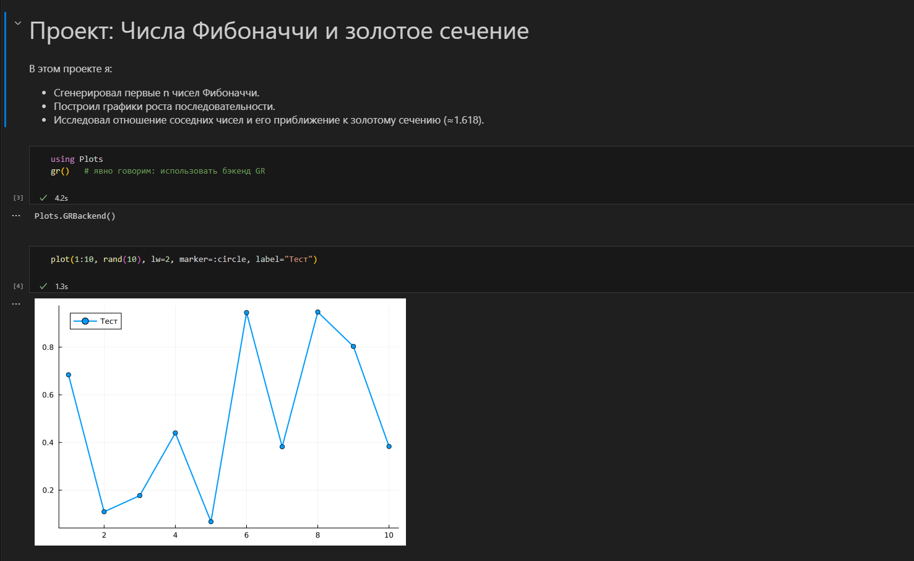
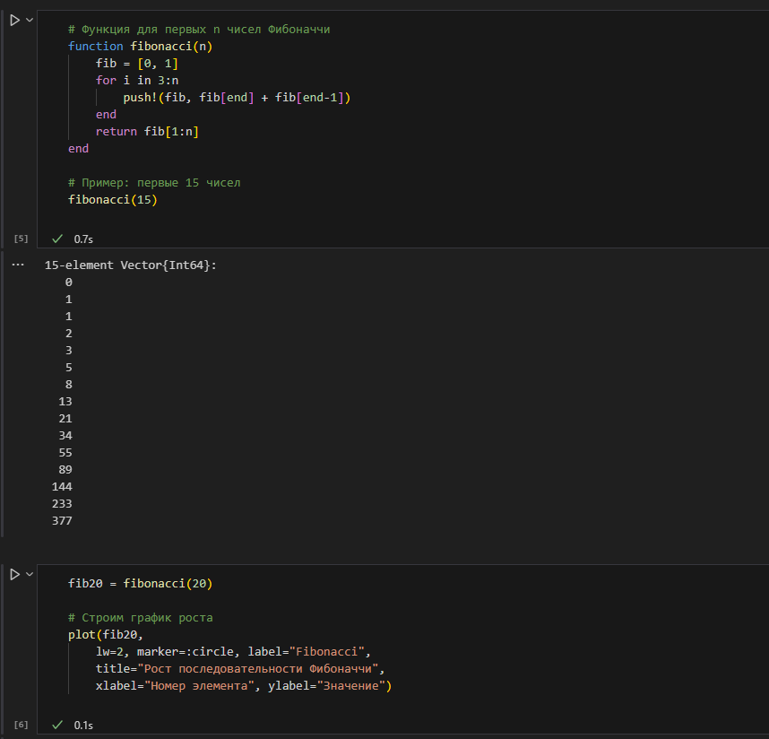
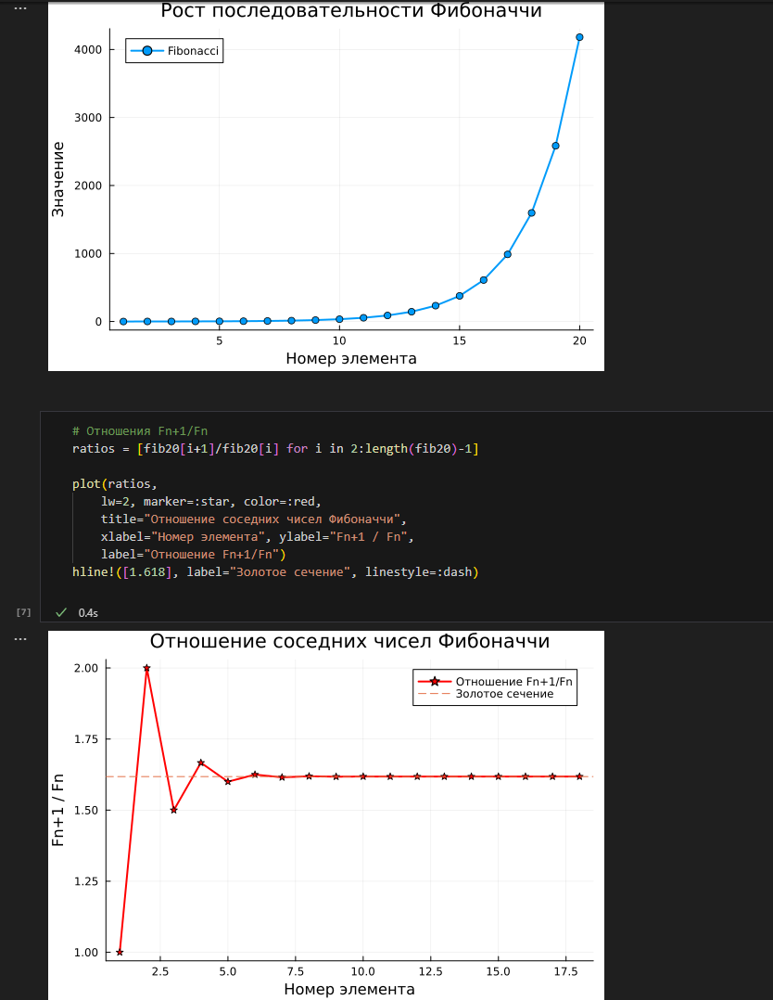

# Проект: Числа Фибоначчи в Julia

## Описание
Этот проект демонстрирует работу с языком **Julia** в Jupyter Notebook.  
В рамках проекта реализованы:
- генерация чисел Фибоначчи;
- визуализация последовательности;
- построение графиков;
- работа с итеративными и рекурсивными функциями.

Проект создан для обучения работе в **.ipynb** файлах с использованием Julia и IJulia.

---

## Требования
Перед запуском необходимо установить:
- [Julia](https://julialang.org/downloads/) (рекомендуется последняя версия, например 1.11+)
- [Jupyter Notebook](https://jupyter.org/install) (через Python или Anaconda)
- Пакеты Julia:
  ```julia
  using Pkg
  Pkg.add("IJulia")
  Pkg.add("Plots")

---

## Запуск проекта
1. Клонируйте или скачайте репозиторий с проектом.
2. Откройте Fibonacci.ipynb в Jupyter Notebook или VS Code.
3. Выполните ячейки по порядку.

---

## Содержимое проекта (в скриншотах)



